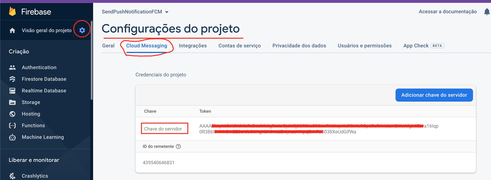

# SendPushNotificationFCM
## An Android App Util of how to push a notification using Firebase Cloud Messaging

* Kotlin
* Push Notification
* Firebase Cloud Messaging - FCM
* Send notification from Firebase console FCM

* To find the server key, go to the Firebase console:

* To access the device fcm registration token:
* https://firebase.google.com/docs/cloud-messaging/android/client#retrieve-the-current-registration-token
* https://firebase.google.com/docs/cloud-messaging/android/client#monitor-token-generation

### Reference
* https://www.youtube.com/watch?v=2xoJi-ZHmNI