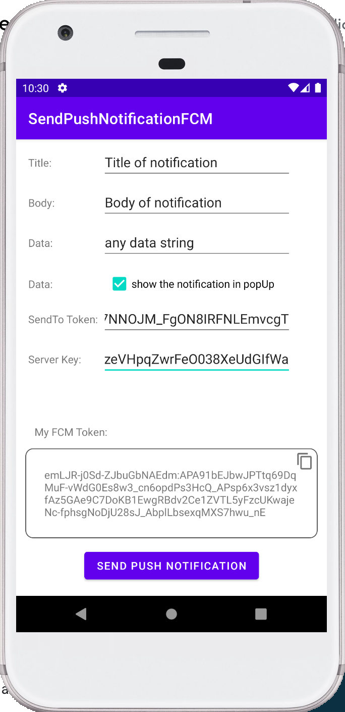

# SendPushNotificationFCM
## An Android App Util of how to push a notification using Firebase Cloud Messaging

* Kotlin
* Push Notification
* Firebase Cloud Messaging - FCM
* Send notification from Firebase console FCM

### Reference
* https://www.youtube.com/watch?v=2xoJi-ZHmNI